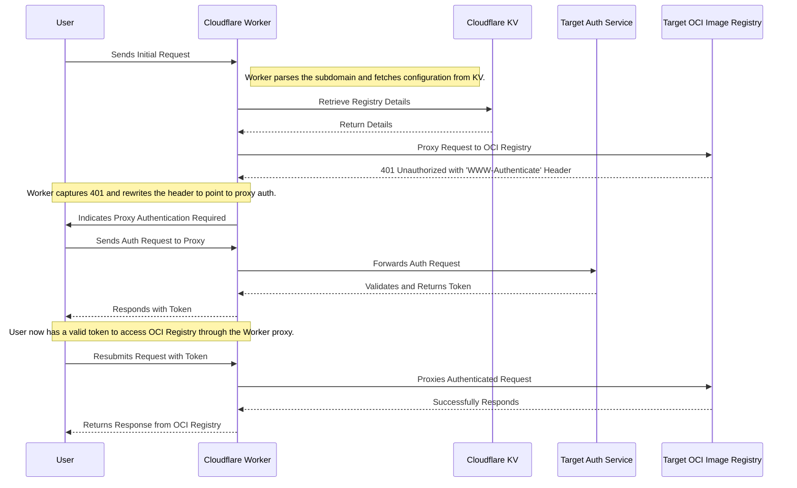

# registry-proxy
Use Cloudflare Workers to proxy repositories that implement OCI Distribution Spec (ghcr, gcr, etc.)
> Inspired by [cloudflare-docker-proxy](https://github.com/ciiiii/cloudflare-docker-proxy)


## Features

- [x] **Quick Access**: Leverages Cloudflare's network for significantly faster image access.
- [x] **Dynamic Matching**: Dynamically fetches records from Cloudflare KV based on the request subdomain for automatic proxying to the correct registry.
- [x] **Authentication**: Captures Need-Authentication Response to redirect users for authentication via the proxy, simplifying the auth process.
- [x] **Open-Source Advantage**: Fully open-source project, allowing technical personnel to contribute or customize as needed.
- [x] **Simple Configuration**: Easily manage proxy settings by editing JSON data in KV.
- [ ] **R2 Object Storage Caching**: Implement caching of images using Cloudflare's R2 Storage Buckets.
- [ ] **Configuration Management RESTful API**: Develop a RESTful API for easier and more flexible configuration management.
- [ ] **Implement the push API**

## Sequence Diagram



## Demo

| Target SVC  | Proxy SVC                                       |
|------|---------------------------------------------|
| ghcr | ghcr.registry.mjolnir.tools , ghcr.registry.haidong.technology |
| gcr | gcr.registry.mjolnir.tools , gcr.registry.haidong.technology |
| docker | docker.registry.mjolnir.tools , docker.registry.haidong.technology |
| k8s | k8s.registry.mjolnir.tools , k8s.registry.haidong.technology |

Try it:

```shell
docker pull ghcr.registry.mjolnir.tools/haidongpang/hello-world

# or

docker pull ghcr.registry.haidong.technology/haidongpang/hello-world
```

## Local Dev

### Requirements
Ensure you have installed the following tools:
- [Bun](https://bun.sh/)

And have a [Cloudflare](https://www.cloudflare.com/zh-cn/) account.

### Step 1: Clone the Codebase

Firstly, clone the codebase to your local machine:

```shell
git clone https://github.com/HaidongPang/registry-proxy.git

cd registry-proxy
```

### Step 2: Install Dependencies

```shell
bun install
```

### Step 3: Start the Local Server

```shell
bun run dev
```

## Deployment

### Automatic Deployment
[](https://deploy.workers.cloudflare.com/?url=https://github.com/HaidongPang/registry-proxy)

- fork this project
- modify the link of the above button to your fork url
- click the button, you will be redirected to the deploy page
- Create a KV Namespace in the Cloudflare dashboard and bind it to your Worker


### Manual Deployment

#### Requirements
Ensure you have installed the following tools:
- [Bun](https://bun.sh/)

And have a [Cloudflare](https://www.cloudflare.com/zh-cn/) account.

#### Step 1: Clone the Codebase

Firstly, clone the codebase to your local machine:

```shell
git clone https://github.com/HaidongPang/registry-proxy.git

cd registry-proxy
```

#### Step 2: Install Dependencies

```shell
bun install
```

#### Step 3: Create a KV Namespace and Bind it to Your Worker

```shell
wrangler kv:namespace create mjolnir-registry-uploads
```

> Modify the wrangler.toml 'kv_namespaces.id' field to the KV Namespace you created to bind the KV Namespace to the worker

#### Step 4: Deployment

```shell
bun run deploy
```

---

## Post-Deployment Processing

### Add Proxy Repository Mapping

> After deployment, you need to add the following record in the bound KV Namespace:

| Key  | Value                                       |
|------|---------------------------------------------|
| ghcr | {"targetDomain":"ghcr.io", "authEndpoint":"https://ghcr.io/token"} |
| gcr  | {"targetDomain":"gcr.io", "authEndpoint":"https://gcr.io/v2/token"} |
| docker | {"targetDomain":"registry-1.docker.io","authEndpoint":"https://auth.docker.io/token"} |
| k8s | {"targetDomain":"registry.k8s.io","authEndpoint":"https://registry.k8s.io/v2/token"} |

### Add Domain Name Resolution

> Add the following four custom domain names to your worker (assuming you own the example.org domain):

- ghcr.example.org
- gcr.example.org
- docker.example.org
- k8s.example.org